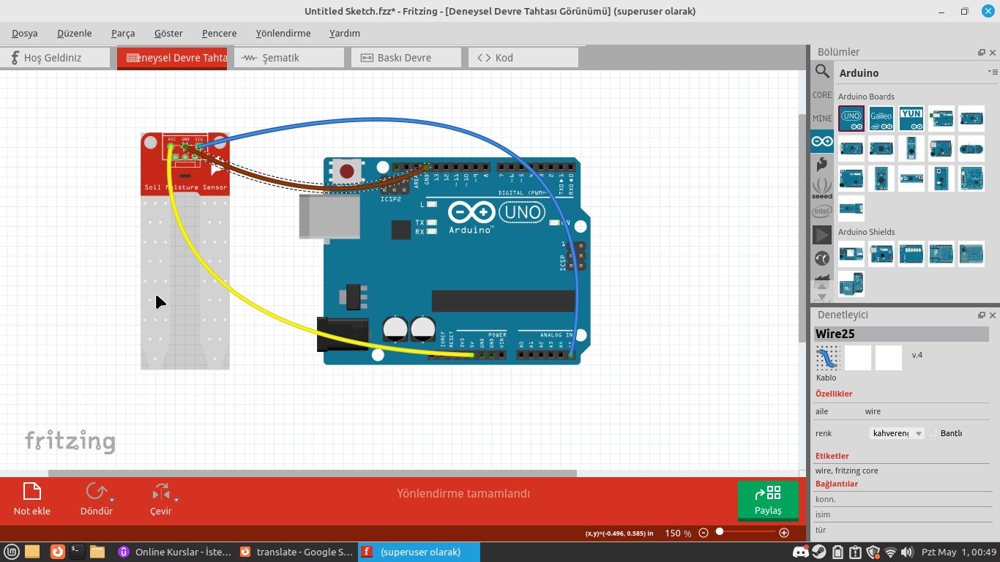

# Whats this project about?

>This project, gets data with arduino (any sensor, but made for moisture meter) and makes graphics about moisture meter.

>Arduino IDE 

# Setupping code

First you need to download python and arduino ide. 
There are links:

[Arduino IDE](https://www.arduino.cc/en/software)

[Python](https://www.python.org/downloads/)

Then you need download libraries for python

>pyserial
`pip install pyserial`

>drawnow
`pip install drawnow`

>matplotlib
"`pip install matplotlib`

Then change dev/tty/usb0 to your port 
(if you are using windows it should be COM3 or COM4)

Then download the arduino.py file but dont start yet.

# Setupping Arduino

- First of all you need a connected arduino card. you need to make same things whit fritzing.png.

- Copy the sketch.ino code and paste to arduino ide.

- Select port and upload to arduino.

- Start python code, then it makes a graph about sensor

# Links - Helpers

My Discord `Cherezza#8297`

My Instagram [@thealprnn](https://instagram.com/thealpernn)

My best helper whit that project is PhysioDinne (semih). Thanks for helping me. <3

His Discord `PhysioDyne#8644`
